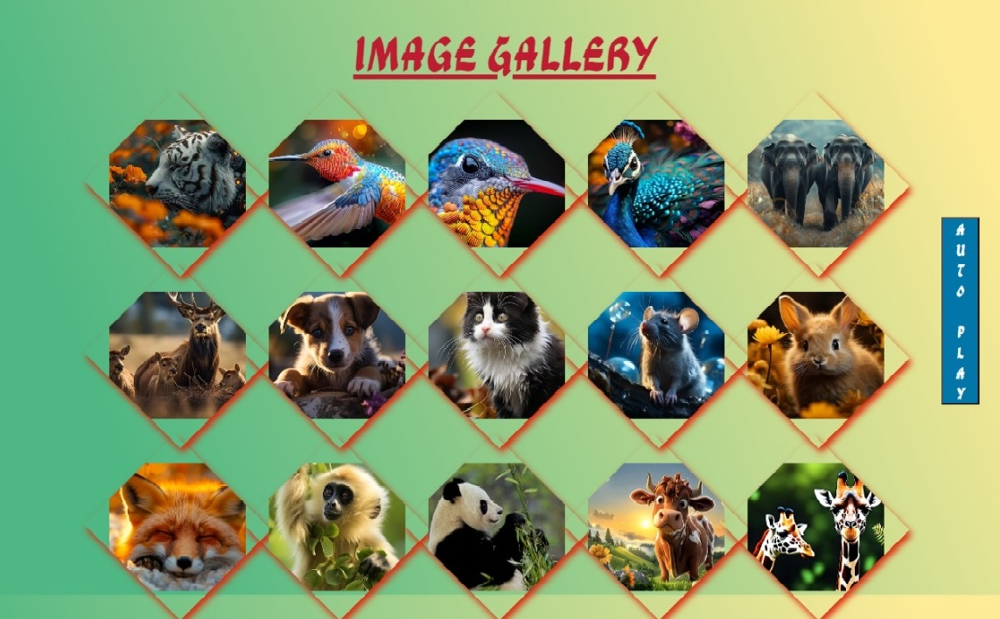

# Image Gallery

## Description

The Image Gallery is a visually appealing image gallery that displays images in a unique diamond shape. The gallery features a hover effect that enlarges the images,rotate the image container and increases their brightness. Additionally, there is an "Auto Zoom" feature that cycles through the images, displaying each one in an enlarged view within a modal. This project uses HTML, CSS, and JavaScript to create an interactive and engaging user experience.

## Features

- **Diamond-Shaped Gallery Items:** Each image is displayed in a diamond shape with a shadow effect.
- **Hover Effect:** When hovering over an image, it scales up and becomes brighter.
- **Modal Image Display:** Clicking on an image opens it in a full-screen modal.
- **Auto Zoom Feature:** Automatically zooms and cycles through the images in the gallery.

## Technologies Used

- **HTML:** For the structure of the webpage.
- **CSS:** For styling the gallery items, hover effects, modal, and other elements.
- **JavaScript:** For handling interactions such as opening the modal, implementing the auto-zoom feature, and managing events.

